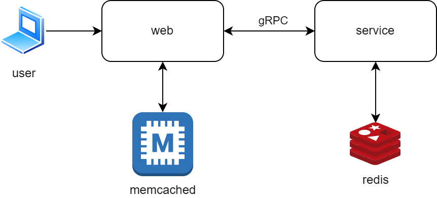

# ShortLink
This repository contains a pet project in the Golang language. A web server and a backend service are implemented, which are connected via gRPC. The backend uses the Redis NoSQL database as storage. The frontend part uses the Memcached database as a cache. The image below shows the architecture of the application.



Docker files have also been written to build docker images, as well as a compose file.yml for deploying the entire application using Docker.
```sh
docker compose up
```

Deployment and service files have been written for the Kubernetes service.